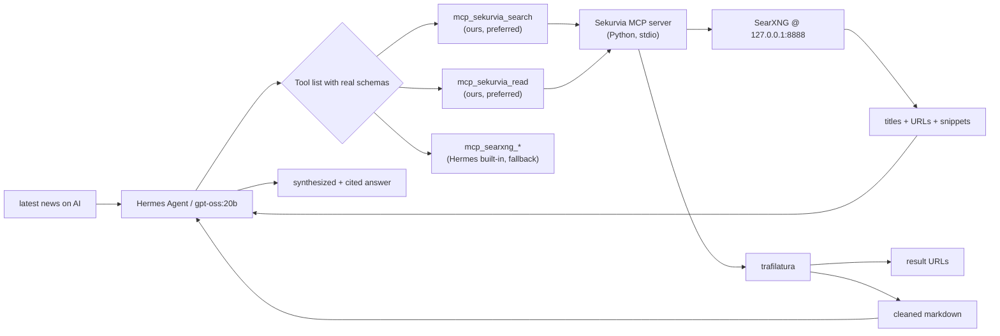

# Sekurvia

[](LICENSE)

**Sekurvia** is an [MCP](https://modelcontextprotocol.io/) server that gives [Hermes Agent](https://hermes-agent.nousresearch.com/) (and any other MCP-compatible client) reliable, schema-typed access to **self-hosted [SearXNG](https://searxng.org/) web search** and **[trafilatura](https://trafilatura.readthedocs.io/)-based content extraction**.

It is the answer to "Hermes can't actually answer 'latest news on X' or 'current price of Y' even though my SearXNG is up." Sekurvia exposes two tools to the agent's tool list with strict JSON schemas:

- `mcp_sekurvia_search` — `{query, max_results, time_range, language, safesearch, categories, page}` → `{count, results: [{title, url, snippet, engine, score}]}`
- `mcp_sekurvia_read` — `{url, max_chars, include_links}` → `{title, author, publish_date, content, content_length, truncated, ...}`

Because they're real tools (not prose loaded via a slash command), even small models like `gpt-oss:20b` call them correctly: no hallucinated tool names like `searxng-search`, no invented arg fields like `recency_days` / `categories: []` / `max_results` on the wrong tool, no fake env vars like `REQUIRED_ENVIRONMENT_VARIABLES` or `SEKURVIA_ENABLED`. The schema is the contract; the model can't escape it.



## Repo layout

```text
Sekurvia/
├── flake.nix                          ← packages.<sys>.sekurvia-mcp + nixosModules.default + overlays.default
├── pyproject.toml                     ← Python build (hatchling) + dev deps + ruff/pytest config
├── src/sekurvia_mcp/
│   ├── server.py                      ← MCP server (stdio) — registers `search` + `read`
│   ├── search.py                      ← SearXNG JSON-API client (async httpx)
│   ├── read.py                        ← URL → trafilatura → cleaned markdown
│   ├── config.py                      ← env-var loading + validation
│   └── filters.py                     ← SSRF / domain allow-block
├── tests/                             ← pytest (56 cases): config, filters, search, read, server
├── modules/nixos/sekurvia.nix         ← NixOS module wiring into nyxorn's hermes.mcpServers
├── examples/nyxorn.nix                ← copy-pasteable host config
└── searxng-search/                    ← Legacy skill, slimmed to a 65-line routing pointer
    ├── SKILL.md
    ├── scripts/                       ← bash escape hatches (searxng-query.sh, searxng-health.sh)
    └── references/searxng-api.md      ← on-demand SearXNG API reference
```

## Quickstart — NixOS via [nyxorn](https://github.com/xor-xe/nyxorn)

This is the path the project was designed for. nyxorn already runs Hermes, runs a local SearXNG, and exports `SEARXNG_URL=http://127.0.0.1:8888` to the agent's environment. All Sekurvia adds is the MCP server + a tiny skill.

### 1. Add Sekurvia as a flake input

```nix
# flake.nix
{
  inputs = {
    nixpkgs.url    = "github:NixOS/nixpkgs/nixos-unstable";
    nyxorn.url     = "github:xor-xe/nyxorn";
    sekurvia.url   = "github:xor-xe/Sekurvia";

    # Recommended: keep nixpkgs aligned so Python deps resolve from one tree.
    sekurvia.inputs.nixpkgs.follows = "nixpkgs";
  };

  outputs = inputs@{ nixpkgs, nyxorn, sekurvia, ... }: {
    nixosConfigurations.yourhost = nixpkgs.lib.nixosSystem {
      system = "x86_64-linux";
      specialArgs = { inherit inputs; };
      modules = [
        nyxorn.nixosModules.default
        sekurvia.nixosModules.default
        ./host.nix
      ];
    };
  };
}
```

### 2. Wire it into your host config

```nix
# host.nix
{ pkgs, inputs, ... }: {
  nixpkgs.overlays = [ inputs.sekurvia.overlays.default ];

  services.aiAgent = {
    enable          = true;
    engine          = "hermes";
    enableSearxng   = true;
    searxng.secretKey = "<openssl rand -hex 32>";

    defaultModel = "gpt-oss:20b";   # any model works; bigger ones answer more accurately

    # Skill body — routing pointer, not a tool. ~65 lines.
    hermes.skills."research/searxng-search" =
      inputs.sekurvia + "/searxng-search";

    # The MCP tools. Auto-enabled when engine == "hermes".
    sekurvia.enable = true;

    hermes.settings = {
      toolsets              = [ "all" ];
      memory.memory_enabled = true;
    };
  };
}
```

A complete host module is in [examples/nyxorn.nix](examples/nyxorn.nix).

### 3. Rebuild and verify

```bash
sudo nixos-rebuild switch --flake .#yourhost
nyxorn-status                       # confirm hermes-agent + searxng services are up

# In a Hermes session:
/searxng-search what is the latest news on AI agents
```

The model should pick `mcp_sekurvia_search` first (the assertive tool description steers it there), optionally call `mcp_sekurvia_read` on the most relevant URL, and answer with citations. If you instead see it pick `mcp_searxng_searxng_web_search` (Hermes' auto-registered toolset), that's also fine — both work; Sekurvia's variant just has a richer schema and trafilatura-cleaned output.

## Quickstart — non-nyxorn Hermes

For a plain Hermes install:

```bash
pip install sekurvia-mcp           # or: pipx install sekurvia-mcp

# Make sure SearXNG is reachable and JSON format is enabled.
export SEARXNG_URL=http://127.0.0.1:8888
```

Add to your Hermes `config.yaml`:

```yaml
mcpServers:
  sekurvia:
    command: sekurvia-mcp
    args: []
    env:
      SEARXNG_URL: http://127.0.0.1:8888
      # Optional auth + tuning vars below.
```

(Optionally also drop the `searxng-search/` directory into `~/.hermes/skills/research/` so the slash command is available.)

## Tool reference

### `mcp_sekurvia_search`

> Search the live web via a self-hosted SearXNG instance. Use this for ANY query requiring real-time data: latest news, current prices, recent events, library or API documentation lookup, fact-checking. Returns titles, URLs, and snippets. Pair with `mcp_sekurvia_read` to fetch full page content. Always prefer this over guessing facts you don't already know.
>
> Tool name when calling: `mcp_sekurvia_search` (flat snake_case identifier; no colons, no dots, no namespacing — copy it exactly from your tool list).

| Field | Type | Required | Default | Notes |
|---|---|---|---|---|
| `query` | string | yes | — | Plain text, max 1024 chars. |
| `max_results` | integer | no | `10` | 1–50 hard ceiling. |
| `time_range` | enum | no | `""` | `"day"` for breaking news, `"week"`, `"month"`, `"year"`, or `""`. |
| `language` | string | no | `"auto"` | ISO 639-1 code, or `auto` / `all`. |
| `safesearch` | integer | no | `1` | `0` off, `1` moderate, `2` strict. |
| `categories` | string | no | `""` | Comma-separated SearXNG categories: `general`, `news`, `it`, `science`, etc. |
| `page` | integer | no | `1` | Pagination, 1–20. |

Response envelope:

```json
{
  "query": "...",
  "count": 5,
  "results": [
    { "title": "...", "url": "https://...", "snippet": "...", "engine": "duckduckgo", "score": 0.83 }
  ],
  "engines_unresponsive": []
}
```

Or on failure:

```json
{ "error": "...", "kind": "ConfigError|ValidationError|NetworkError|RemoteError|InternalError" }
```

### `mcp_sekurvia_read`

> Fetch a URL and return the main article text as cleaned markdown — ads, navigation, comment threads, and footer boilerplate are stripped via trafilatura. Use after `mcp_sekurvia_search` on the most relevant result(s). Default returns up to 8000 chars; pass `max_chars` (up to 50000) to extend. Refuses non-routable / private hosts and `file://` schemes.
>
> Tool name when calling: `mcp_sekurvia_read` (flat snake_case identifier; no colons, no dots, no namespacing — copy it exactly from your tool list).

| Field | Type | Required | Default | Notes |
|---|---|---|---|---|
| `url` | string | yes | — | Absolute http(s) URL. SSRF-checked. |
| `max_chars` | integer | no | `8000` | 500–50000. |
| `include_links` | boolean | no | `false` | Preserve inline links in the markdown output. |

Response envelope:

```json
{
  "url": "https://...",
  "title": "Article title",
  "author": "Ada Lovelace",
  "publish_date": "2026-04-01",
  "content": "# Article title\n\nMain article body, cleaned, in markdown...",
  "content_length": 4321,
  "truncated": false,
  "content_type": "text/html; charset=utf-8"
}
```

Same `{error, kind}` envelope on failure.

## Configuration

The MCP server reads exactly two required env vars and a handful of optional tuning ones — anything else is invented. The Sekurvia NixOS module reads `services.aiAgent.searxng.url` (which nyxorn defaults to `http://127.0.0.1:8888` when `enableSearxng = true`) and injects it as `SEARXNG_URL` directly on the MCP child process.

> **Why the explicit injection?** Hermes does set `SEARXNG_URL` on the gateway process itself, but its MCP launcher does not propagate that env to MCP child subprocesses. As a result, the upstream `mcp_searxng_*` toolset and any other MCP server that expects `SEARXNG_URL` to "just be there" get spawned with an empty environment and report `SEARXNG_URL not set`. The Sekurvia module sidesteps this by passing the variable through `mcpServers.sekurvia.env` explicitly. If you want to override (remote SearXNG, different port), set `services.aiAgent.sekurvia.searxngUrl` or put `SEARXNG_URL` into `services.aiAgent.sekurvia.extraEnv` (the latter wins).

### Required (2)

| Variable | Required? | Description |
| --- | --- | --- |
| `SEARXNG_URL` | yes | Base URL of your SearXNG instance, e.g. `http://127.0.0.1:8888`. Must include scheme. |
| `SEKURVIA_AUTH_TOKEN` | no | `Authorization: Bearer …` for protected SearXNG instances. Skip for local. |

### Optional tuning

| Variable | Default | Description |
| --- | --- | --- |
| `SEKURVIA_TIMEOUT_S` | `10` | Per-request timeout (seconds). 1–120. |
| `SEKURVIA_MAX_RESULTS` | `10` | Default cap for `max_results`. 1–50. |
| `SEKURVIA_SAFESEARCH` | `1` | Default safesearch level. 0–2. |
| `SEKURVIA_LANGUAGE` | `auto` | Default ISO 639-1 language. |
| `SEKURVIA_USER_AGENT` | `sekurvia-mcp/0.3` | UA sent to SearXNG and to fetched pages. |
| `SEKURVIA_ALLOWED_DOMAINS` | unset | Comma-separated host allowlist; subdomains match. If set, only matching hosts pass the URL filter. |
| `SEKURVIA_BLOCKED_DOMAINS` | unset | Comma-separated host blocklist; takes precedence over the allowlist. |
| `SEKURVIA_MAX_RESPONSE_BYTES` | `2097152` (2 MiB) | Hard cap on response sizes. 1024–16777216. |
| `SEKURVIA_MAX_SNIPPET` | `500` | Per-result snippet truncation length. |
| `SEKURVIA_HEALTH_TIMEOUT_S` | `5` | Timeout for `searxng-health.sh`. |
| `SEKURVIA_LOG_LEVEL` | `INFO` | Logger level (`DEBUG`/`INFO`/`WARNING`/`ERROR`). Logs go to stderr; stdout is reserved for the MCP protocol. |

### Variable names that are NOT real

A few names that small models like to invent: **none of these exist** and the server does not read them. If a tool response complains about configuration, only the variables in the tables above are relevant.

| Looks like | Reality |
|---|---|
| `REQUIRED_ENVIRONMENT_VARIABLES` | A YAML schema label in SKILL.md frontmatter, not a variable. |
| `SEKURVIA_ENABLED` | Doesn't exist. Probably confused with the nyxorn module option `services.aiAgent.enableSearxng`, which is a NixOS option, not an env var. |
| `SEARXNG_API_KEY` / `SEARXNG_TOKEN` | SearXNG itself is API-key-free; only `SEKURVIA_AUTH_TOKEN` exists, and only for reverse-proxy bearer auth. |
| `SEKURVIA_URL` | Backwards. The variable is `SEARXNG_URL`. |

## Coexistence with Hermes' built-in `mcp_searxng_*`

When nyxorn sets `services.aiAgent.enableSearxng = true` and you ask Hermes to enable `toolsets = [ "all" ]`, Hermes auto-registers an MCP server named `searxng` exposing `mcp_searxng_searxng_web_search` and `mcp_searxng_web_url_read`. Sekurvia is **additive** — it registers a different MCP server name (`sekurvia`), so the model sees both:

| Tool | Source | When the model picks it |
|---|---|---|
| `mcp_sekurvia_search` | Sekurvia | Preferred — assertive description, richer args (categories, page), filter-tuneable. |
| `mcp_sekurvia_read` | Sekurvia | Preferred — trafilatura-cleaned markdown, `max_chars` knob, SSRF-safe. |
| `mcp_searxng_searxng_web_search` | Hermes built-in | Fallback. |
| `mcp_searxng_web_url_read` | Hermes built-in | Fallback. |

Both work. Tool descriptions and the slimmed `searxng-search/SKILL.md` route the model toward Sekurvia for the cleaner output, but if for any reason it lands on `mcp_searxng_*`, your search still happens.

If you want a single search provider in the tool list, disable Hermes' built-in via your nyxorn config (consult `services.aiAgent.hermes.settings.toolsets` to opt out of `searxng` while keeping the rest). Sekurvia stays unchanged either way.

## Migration from v0.2.x (skill-only)

If you were on the previous markdown-skill release:

```nix
# v0.2.x — still valid, the skill itself stays
services.aiAgent.hermes.skills."research/searxng-search" =
  inputs.sekurvia + "/searxng-search";
```

For v0.3.0, **add** the MCP server:

```nix
# in flake.nix
inputs.sekurvia.url = "github:xor-xe/Sekurvia";

# in your host module
nixpkgs.overlays = [ inputs.sekurvia.overlays.default ];

imports = [ inputs.sekurvia.nixosModules.default ];

services.aiAgent.sekurvia.enable = true;   # auto-true when engine == "hermes"
```

Nothing else changes. The skill directory name (`searxng-search`), the slash command (`/searxng-search`), the env vars, and the helper scripts stay where they were. The new SKILL.md body just routes the model toward `mcp_sekurvia_*` instead of teaching prose-only methods.

## Smoke-test sequence

After the first install or after any change:

```bash
# 1. Build the package + run unit tests in one step.
nix flake check

# 2. Optional — start the server interactively over stdio (Ctrl-D to quit).
SEARXNG_URL=http://127.0.0.1:8888 nix run .#sekurvia-mcp

# 3. After `nixos-rebuild switch`, verify the agent picked it up.
nyxorn-status
journalctl -u hermes-agent -n 50 --no-pager

# 4. In a Hermes session — the actual end-to-end smoke test.
/searxng-search what is the latest news on AI agents
```

What you want to see in the model's reasoning trace:

1. A call to `mcp_sekurvia_search` with `{ "query": "...", "time_range": "day" }` (or similar).
2. A call to `mcp_sekurvia_read` on the most relevant result URL.
3. A short answer that cites the URL.

What you do **not** want to see — and what v0.3.0 makes structurally impossible:

- A tool call named `searxng-search` (that's the skill, not a tool).
- Arguments like `recency_days`, `categories: []`, or `max_results` on the MCP search tool — they're not in the schema; the server returns a `ValidationError` envelope.
- The model claiming `REQUIRED_ENVIRONMENT_VARIABLES` or `SEKURVIA_ENABLED` are unset — they don't exist and the README plus SKILL.md both call this out explicitly.
- A tool name with `:` or `.` separators (e.g. `mcp:search:mcp_search`, `mcp.sekurvia.search`). These are model hallucinations — the runtime rejects them. The only valid names are the four flat-snake-case identifiers shown in your tool list. v0.3.1 of the SKILL.md and the tool descriptions explicitly call this out.

If `gpt-oss:20b` ignores the tool descriptions and tries to answer from training data (a weakness of small models in general, not of Sekurvia), bump to one of your bigger pre-pulled models:

```nix
services.aiAgent.defaultModel = "qwen3.6:35b";  # or "gemma4:26b"
```

Both will follow the tool routing reliably. `gpt-oss:20b` is fine for casual chat where strict tool-call discipline doesn't matter.

## Security model

Defense-in-depth, mostly inherited from the v0.2.x bash helper and reimplemented in Python:

- **Localhost by default** — operators are expected to point `SEARXNG_URL` at `127.0.0.1`. Search queries never leave the host.
- **No redirect-following** — `httpx.AsyncClient(follow_redirects=False)`. A 3xx surfaces as a `RemoteError` instead of being chased to an unknown host.
- **Response size caps** — 2 MiB default, 16 MiB hard ceiling. Reject larger bodies as `RemoteError`.
- **Bounded timeout** — 10s default per request; configurable via `SEKURVIA_TIMEOUT_S` up to 120s.
- **HTML stripping** — every `title` / `snippet` runs through `<…>`-stripping before the model sees it. `read` tool output goes through trafilatura (which already drops scripts/styles/nav/footer).
- **SSRF guard** — `mcp_sekurvia_read` rejects URLs that resolve to loopback / link-local / private / multicast / reserved address space. Override per-host with `SEKURVIA_ALLOWED_DOMAINS`.
- **Optional bearer auth** — `SEKURVIA_AUTH_TOKEN` is sent only when set, never logged.
- **Transport isolation** — `httpx.AsyncClient(trust_env=False)` so HTTP_PROXY etc. from a misconfigured host shell can't redirect search/read traffic.

## Development

```bash
git clone https://github.com/xor-xe/Sekurvia
cd Sekurvia

# Editable install + dev deps
python3 -m venv .venv
.venv/bin/pip install -e ".[dev]"

# Run the test suite (56 cases, ~1s).
.venv/bin/pytest -q

# Lint
.venv/bin/ruff check src tests

# Or via nix
nix flake check
nix run .#sekurvia-mcp        # run the server interactively
```

Validate the slimmed SKILL.md frontmatter:

```bash
python3 -c '
import re, pathlib
p = pathlib.Path("searxng-search/SKILL.md").read_text()
m = re.match(r"^---\n(.*?)\n---\n", p, re.S)
front = m.group(1)
def field(n):
    mm = re.search(rf"^{n}:\s*(.+)$", front, re.M)
    return mm.group(1).strip() if mm else None
print("ok:", field("name"), "v" + field("version"), "desc_len=" + str(len(field("description"))))
'
```

## License

MIT — see [LICENSE](LICENSE).
